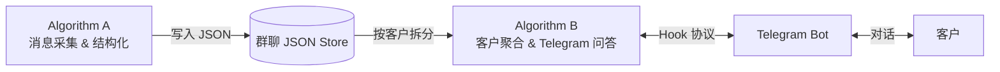
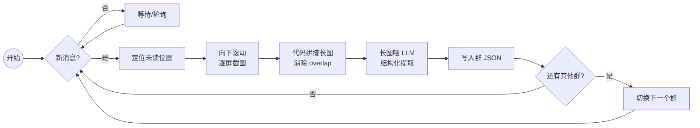
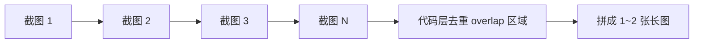
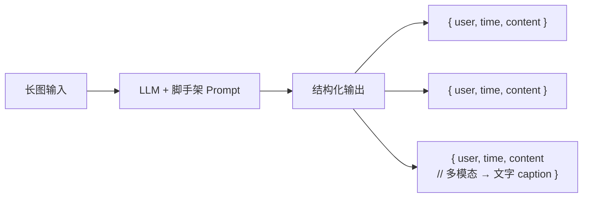
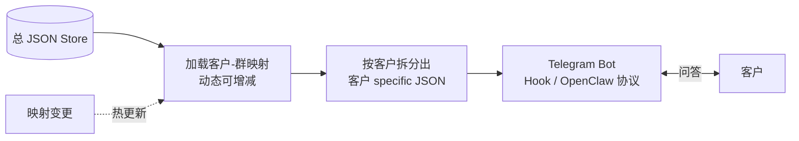
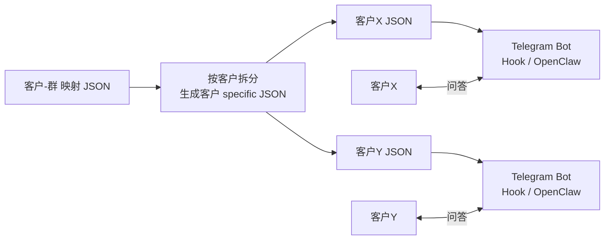
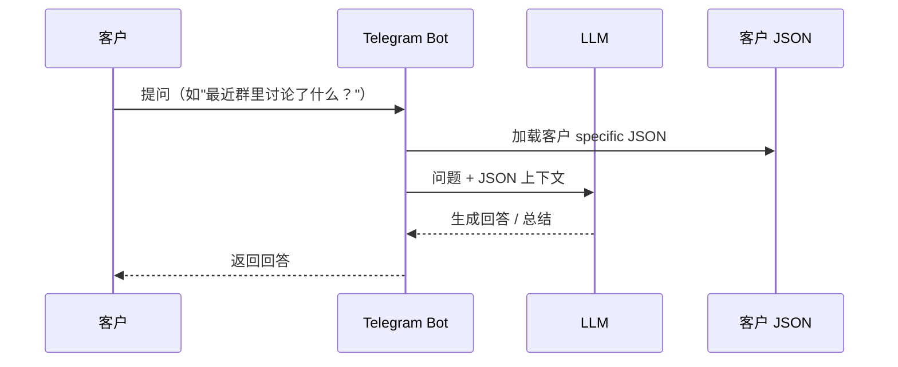
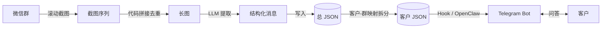

# WeChat 群消息自动监控 & 客户问答系统

---

## 系统总览

两套算法协同工作：**Algorithm A** 负责消息采集与结构化存储，**Algorithm B** 负责按客户维度聚合并通过 Telegram 提供问答服务。



---

## Algorithm A — 消息采集循环

> 核心循环：检测新消息 → 滚动截图 → 拼接长图 → LLM 结构化 → 写入 JSON → 下一个群



---

### A-1 滚动截图 & 拼接



**收益：**

- 减少 LLM inference 次数
- LLM 一次看到更完整上下文
- 提前在图像层消掉重复区域，不让 overlap 反复进入 LLM

---

### A-2 LLM 结构化提取

LLM 接收长图，输出结构化消息列表。对多模态内容（图片 / 视频 / 语音 / 文件）生成文字 caption。



---

### A-3 JSON 存储结构

```json
{
  "群名A": [
    {
      "user": "张三",
      "time": "2026-03-11 14:02",
      "content": "今天下午开会吗？"
    },
    {
      "user": "李四",
      "time": "2026-03-11 14:03",
      "content": "[图片] caption: 一张会议室白板的照片，上面写着Q2 OKR"
    }
  ],
  "群名B": [ ... ]
}
```

---

## Algorithm B — 客户聚合 & Telegram 问答

> 核心逻辑：维护一份「客户 → 群列表」的动态映射，据此从总 JSON 中拆出客户专属子集，再通过 Telegram Bot 提供问答。



---

### B-1 客户-群映射（动态）

```json
{
  "客户X": ["群名A", "群名C"],
  "客户Y": ["群名B", "群名D", "群名E"]
}
```

此映射随时可增减，系统自动根据变更重新聚合。

---

### B-2 聚合 & 问答流程



---

### B-3 单次问答流



---

## 完整数据流一览


