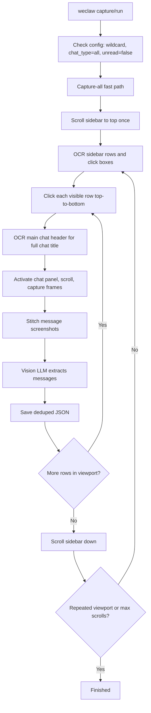

<div align="center">


### Vision-based WeChat message capture and report generation from the command line.

[](LICENSE)
[](https://www.python.org/)
[](#system-requirements)
[](CONTRIBUTING.md)

**[Installation Guide](docs/installation.md)** &middot; **[中文文档](README_CN.md)**

</div>

---

<details>
<summary><strong>Table of Contents</strong></summary>

- [Highlights](#highlights)
- [How It Works](#how-it-works)
- [Installation](#installation)
- [Quick Start](#quick-start)
- [OpenClaw Gateway Mode](#openclaw-gateway-mode)
- [Using with AI Agents (Stepwise Mode)](#using-with-ai-agents-stepwise-mode)
- [Command Reference](#command-reference)
- [Message Types](#message-types)
- [System Requirements](#system-requirements)
- [Configuration](#configuration)
- [Architecture](#architecture)
- [Contributing](#contributing)
- [License](#license)

</details>

---

## Highlights

| | |
|:--|:--|
| **Vision-based capture** | Screenshots + vision LLM to extract messages — no database decryption |
| **Cross-platform** | macOS (Accessibility API + Quartz) and Windows (UI Automation) |
| **No API key required** | Stepwise mode lets the calling agent handle all LLM calls |
| **OpenClaw gateway** | Reuse your local OpenClaw gateway — no separate OpenRouter key |
| **AI-first** | JSON output by default, designed for LLM agent tool calls |
| **Fully local** | All UI automation runs on your machine; data never leaves your device |
| **14 commands** | init, run, capture, finalize, report, build-report-prompt, sessions, history, search, ask, export, stats, unread, new-messages |

---

## How It Works

Unlike tools that decrypt WeChat's local SQLite databases, WeClaw-CUA uses a **pure vision approach**:

1. Locates the WeChat desktop window via OS-level APIs
2. Scans the sidebar for chats selected by config or CLI options
3. Clicks into each chat, scrolls through messages, captures screenshots
4. Stitches screenshots into long images (OpenCV-based template matching)
5. Sends stitched images to a vision LLM for structured message extraction
6. Post-processes and deduplicates extracted messages into clean JSON

This means WeClaw-CUA works with **any WeChat version** and requires **no key extraction or database access**.

### Capture-all fast path

When `groups_to_monitor` is `["*"]` or `[]`, `chat_type` is `all`, and
`sidebar_unread_only` is `false` (or `--chat-type all --unread-mode all` is
passed), WeClaw uses a faster visual workflow. In this mode it does not need to
classify sidebar rows as group/private or unread/read. It treats every visible
chat row equally, clicks through the sidebar from top to bottom, and reserves
vision-LLM calls for the actual message extraction step.



The fast path removes these navigation-time vision-LLM calls:

- Sidebar classification VLM: row names and click boxes come from OCR
  (RapidOCR on Windows, native Vision OCR on macOS).
- Per-chat name re-location: capture-all sweeps visible rows instead of
  repeatedly searching from the top for a configured name.
- Post-click current-chat verification VLM: the clicked chat title is read from
  the main chat header with OCR.
- Safe-click VLM and new-message-button VLM: the fast path uses deterministic
  chat-panel activation and skips the optional new-message-button probe.

The normal sidebar classification path is still used for named chats,
group-only/private-only wildcard scans, and unread-only scans, because those
modes need row semantics such as chat type or unread badge state.

---

## Installation

> Requires **Python >= 3.10**. For a full platform-by-platform walkthrough, see the **[Installation Guide](docs/installation.md)**.

```bash
# 1. Create a virtual environment (recommended)
python3 -m venv .venv
source .venv/bin/activate        # macOS / Linux
.venv\Scripts\activate           # Windows PowerShell

# 2. Install
pip install "weclaw-cua[macos,llm]"   # macOS
pip install "weclaw-cua[llm,win-ocr]" # Windows
pip install weclaw-cua                # core only (stepwise, no LLM deps)

# 3. Verify
weclaw-cua --version
```

> **Note:** The PyPI package `weclaw` (without `-cua`) is an unrelated third-party project. Always install **`weclaw-cua`**. The `weclaw` console command is an alias for `weclaw-cua`.

<details>
<summary>Install from source (for contributors)</summary>

```bash
git clone https://github.com/Numaira-Technology/weclaw-cua.git
cd weclaw-cua
python3 -m venv .venv

# macOS
./.venv/bin/pip install -e ".[macos,llm]"

# Windows
.venv\Scripts\pip install -e ".[llm,win-ocr]"
```

</details>

---

## Quick Start

### Before You Start

Make sure all of the following are true before the first run:

- WeChat Desktop is installed, open, and already logged in
- The WeChat window is visible on your desktop
- You are running commands from the project directory (or a subdirectory containing access to `config/config.json`)
- On macOS, your terminal already has Accessibility permission
- On Windows, if WeChat is running as administrator, your terminal is elevated too

### Step 1 &mdash; Initialize

```bash
weclaw-cua init
```

Creates `config/config.json` from the template and verifies platform prerequisites.

> **macOS:** Grant your terminal app Accessibility access in **System Settings > Privacy & Security > Accessibility**, then restart the terminal.
>
> **Windows:** If WeChat is running as administrator, run your terminal elevated too.

### Step 2 &mdash; Configure

Edit `config/config.json`:

```json
{
  "wechat_app_name": "WeChat",
  "groups_to_monitor": ["*"],
  "sidebar_unread_only": true,
  "chat_type": "group",
  "sidebar_max_scrolls": 16,
  "chat_max_scrolls": 10,
  "recent_window_hours": 0,
  "report_custom_prompt": "Summarize key decisions and action items from the captured chat messages.",
  "llm_provider": "openrouter",
  "openrouter_api_key": "",
  "openai_api_key": "",
  "deepseek_api_key": "",
  "kimi_api_key": "",
  "glm_api_key": "",
  "qwen_api_key": "",
  "llm_model": "openai/gpt-4o",
  "output_dir": "output"
}
```

Set `chat_type` to `group`, `private`, or `all`. Set `sidebar_unread_only` to `true` for unread-badge chats only, or `false` to process read and unread chats that match the other selectors. `groups_to_monitor: ["*"]` or `[]` means wildcard scan for all chats allowed by `chat_type`; otherwise list exact sidebar chat names.

Set `sidebar_max_scrolls` to control how many times the sidebar may scroll downward during a scan. WeClaw scrolls back upward with `sidebar_max_scrolls + 2` wheel steps before each full scan, so the return-to-top distance is always greater than the downward scan distance. Set `chat_max_scrolls` to control how many times the active chat panel may scroll upward while collecting history. Set `recent_window_hours` to a positive number to keep only messages from the last N hours; `0` disables the time filter.

Set `llm_provider` to `openrouter`, `openai`, `deepseek`, `kimi`, `glm`, or `qwen`. Fill the matching API key only when using built-in LLM mode. When `llm_provider` is `openrouter`, all model slugs route through OpenRouter. Leave keys empty for OpenClaw gateway mode or stepwise mode.

You can also set API keys via environment variables:

```bash
export OPENROUTER_API_KEY="sk-or-v1-your-key"          # macOS
export OPENAI_API_KEY="sk-your-openai-key"             # macOS
export DEEPSEEK_API_KEY="sk-your-deepseek-key"         # macOS
export KIMI_API_KEY="sk-your-kimi-key"                 # macOS
export GLM_API_KEY="sk-your-glm-key"                   # macOS
export QWEN_API_KEY="sk-your-qwen-key"                 # macOS
```

```powershell
$env:OPENROUTER_API_KEY = "sk-or-v1-your-key"          # Windows PowerShell
$env:OPENAI_API_KEY = "sk-your-openai-key"             # Windows PowerShell
$env:DEEPSEEK_API_KEY = "sk-your-deepseek-key"         # Windows PowerShell
$env:KIMI_API_KEY = "sk-your-kimi-key"                 # Windows PowerShell
$env:GLM_API_KEY = "sk-your-glm-key"                   # Windows PowerShell
$env:QWEN_API_KEY = "sk-your-qwen-key"                 # Windows PowerShell
```

### Step 3 &mdash; Run

```bash
weclaw-cua run --openclaw-gateway   # recommended: via local OpenClaw gateway
weclaw-cua run                      # built-in LLM mode
weclaw-cua run --chat-type all --unread-mode all  # triggers capture-all fast path
weclaw-cua capture                  # capture only
weclaw-cua report                   # report from existing captures
weclaw-cua sessions                 # list captured chats
weclaw-cua history "Group A" --limit 20
weclaw-cua search "deadline" --chat "Team"
weclaw-cua ask "Who needs a reply?"
```

---

## OpenClaw Gateway Mode

Recommended for users who already run a local OpenClaw gateway — no separate OpenRouter key needed.

### One-time gateway setup

Enable the OpenAI-compatible HTTP endpoint in `~/.openclaw/openclaw.json`:

```json5
{
  gateway: {
    http: {
      endpoints: {
        chatCompletions: { enabled: true },
      },
    },
  },
}
```

Restart the OpenClaw gateway, then smoke-test it:

```bash
curl -sS http://127.0.0.1:18789/v1/models \
  -H "Authorization: Bearer YOUR_GATEWAY_TOKEN"
```

A JSON response listing model IDs (e.g. `openclaw/default`) means the gateway is ready.

### Run through OpenClaw

```bash
weclaw-cua run --openclaw-gateway
```

Most users do not need to set any `OPENCLAW_*` variables manually — WeClaw-CUA auto-discovers the gateway from `~/.openclaw/openclaw.json`.

<details>
<summary>Optional environment overrides</summary>

```bash
# macOS
export OPENCLAW_GATEWAY_URL="http://127.0.0.1:18789/v1"
export OPENCLAW_API_KEY="YOUR_GATEWAY_TOKEN"
export OPENCLAW_MODEL="openclaw/default"
export OPENCLAW_BACKEND_MODEL="openrouter/google/gemini-2.5-flash"
```

```powershell
# Windows PowerShell
$env:OPENCLAW_GATEWAY_URL = "http://127.0.0.1:18789/v1"
$env:OPENCLAW_API_KEY = "YOUR_GATEWAY_TOKEN"
$env:OPENCLAW_MODEL = "openclaw/default"
$env:OPENCLAW_BACKEND_MODEL = "openrouter/google/gemini-2.5-flash"
```

</details>

> WeClaw-CUA also auto-discovers `config/config.json` by walking up from the current directory. Set `WECLAW_CONFIG_PATH` or pass `--config <path>` only when running from outside the project tree.

---

## Using with AI Agents (Stepwise Mode)

In **stepwise mode** (`--no-llm`), WeClaw-CUA handles all UI automation while the agent handles all LLM calls. No API key needed on the WeClaw-CUA side.

```
Agent                          WeClaw-CUA                    WeChat
  |                              |                              |
  |-- weclaw-cua capture --no-llm -->|                          |
  |                              |-- screenshot, scroll ------->|
  |                              |-- stitch images              |
  |<-- manifest.json + images ---|                              |
  |                              |                              |
  |  (agent reads manifest.json)                                |
  |  (for each task: send .png + .prompt.txt to own LLM)        |
  |  (write response to .response.txt)                          |
  |                              |                              |
  |-- weclaw-cua finalize ------->|                             |
  |<-- messages.json ------------|                              |
  |                              |                              |
  |-- weclaw-cua build-report-prompt                            |
  |<-- prompt text --------------|                              |
  |  (agent sends prompt to own LLM, gets report)               |
```

### Step-by-Step

**1. Capture** (no LLM needed):

```bash
weclaw-cua capture --no-llm --work-dir ./weclaw_work
```

Outputs `manifest.json` listing all pending vision tasks, plus `.png` images and `.prompt.txt` files.

**2. Process vision tasks** (agent's responsibility):

For each task in `manifest.json`:
- Read the `.png` image and `.prompt.txt`
- Send to the agent's own vision LLM
- Write the model response to `.response.txt`

**3. Finalize** (produce message JSON):

```bash
weclaw-cua finalize --work-dir ./weclaw_work
```

Reads `.response.txt` files from `--work-dir` and writes structured message JSON to `output_dir` (configured in `config.json`). `--work-dir` is required.

**4. Get report prompt** (agent calls own LLM for report):

```bash
weclaw-cua build-report-prompt
```

Reads all `*.json` capture files from `output_dir` — the same directory where `finalize` writes its output.

<details>
<summary>Claude Code / Cursor configuration snippet</summary>

Add to your `CLAUDE.md` or `.cursor/rules/`:

```markdown
## WeClaw-CUA

You can use `weclaw-cua` (or the `weclaw` alias) to capture and query WeChat messages.

Stepwise workflow (you handle LLM calls):
1. `weclaw-cua capture --no-llm` — capture screenshots, no LLM needed
2. Process each task in manifest.json with your vision model
3. `weclaw-cua finalize --work-dir <dir>` — produce message JSON
4. `weclaw-cua build-report-prompt` — get report prompt, call your own LLM

Query commands (work on captured data, no LLM needed):
- `weclaw-cua sessions` — list captured chats
- `weclaw-cua history "NAME" --limit 20 --format text` — view messages
- `weclaw-cua search "KEYWORD" --chat "CHAT_NAME"` — search messages
- `weclaw-cua ask "QUESTION"` — ranked snippets for answering questions from captured messages
- `weclaw-cua stats "CHAT" --format text` — statistics
- `weclaw-cua export "CHAT" --format markdown` — export chat
- `weclaw-cua new-messages` — incremental new messages
```

</details>

---

## Command Reference

See [`docs/cli-reference.md`](docs/cli-reference.md) for every command's options and JSON/text output shape.

| Command | Description |
|:--------|:------------|
| `init` | First-time setup: create config, verify permissions |
| `run` | Full pipeline: capture selected chats + generate report |
| `capture` | Vision-capture selected chats |
| `finalize` | Process agent-provided LLM responses into JSON (`--work-dir` required) |
| `report` | Generate LLM report from existing captured JSON |
| `build-report-prompt` | Output the report prompt (for agent to call own LLM) |
| `sessions` | List captured chat sessions |
| `history` | View messages from a specific session |
| `search` | Search across captured messages |
| `ask` | Retrieve ranked cited snippets for chat-log Q&A |
| `export` | Export a session to markdown or plain text |
| `stats` | Message statistics for a session |
| `unread` | Scan sidebar for unread chats via vision AI |
| `new-messages` | Incremental new messages since last check |

Most commands output JSON by default. Pass `--format text` where available for human-readable output.

<details>
<summary><strong>Per-command examples</strong></summary>

### `init`

```bash
weclaw-cua init                        # create config + verify permissions
weclaw-cua init --force                # overwrite existing config
weclaw-cua init --config-dir /path     # custom config directory
```

### `run`

```bash
weclaw-cua run --openclaw-gateway      # recommended: via local OpenClaw gateway
weclaw-cua run                         # built-in LLM mode
weclaw-cua run --no-llm                # stepwise: capture only, agent handles LLM
weclaw-cua run --format text           # human-readable output
weclaw-cua run --chat-type all --unread-mode all
weclaw-cua run --sidebar-max-scrolls 30 --chat-max-scrolls 20
```

Capture-selection overrides: `--chat-type group|private|all`, `--unread-mode unread|all`, `--sidebar-max-scrolls N`, `--chat-max-scrolls N`.

### `capture`

```bash
weclaw-cua capture                     # capture with built-in LLM
weclaw-cua capture --no-llm            # stepwise: output images + prompts only
weclaw-cua capture --no-llm --work-dir ./weclaw_work
weclaw-cua capture --format text
weclaw-cua capture --chat-type private --unread-mode unread
```

Capture-selection overrides are the same as `run`.

### `finalize`

```bash
weclaw-cua finalize --work-dir ./weclaw_work
```

### `report`

```bash
weclaw-cua report                                     # full report (requires API key)
weclaw-cua report --prompt-only                       # output prompt only
weclaw-cua report --input output/GroupA.json          # from specific file
weclaw-cua report --format text
```

### `build-report-prompt`

```bash
weclaw-cua build-report-prompt
weclaw-cua build-report-prompt --input output/A.json
```

### `sessions`

```bash
weclaw-cua sessions                    # all captured chats (JSON)
weclaw-cua sessions --limit 10
weclaw-cua sessions --format text
```

### `history`

```bash
weclaw-cua history "Group A"                          # last 50 messages
weclaw-cua history "Group A" --limit 100 --offset 50  # pagination
weclaw-cua history "Alice" --type text                # text messages only
weclaw-cua history "Alice" --format text
```

Options: `--limit`, `--offset`, `--type`, `--format`

### `search`

```bash
weclaw-cua search "hello"
weclaw-cua search "hello" --chat "Alice"
weclaw-cua search "meeting" --chat "A" --chat "B"
weclaw-cua search "report" --type text
```

Options: `--chat` (repeatable), `--limit`, `--offset`, `--type`, `--format`

### `ask`

```bash
weclaw-cua ask "When is tomorrow's meeting?"
weclaw-cua ask "Who needs a reply?" --all-history
weclaw-cua ask "deadline" --chat "Team" --format text
```

Returns ranked message windows for an agent to answer from, using `last_run.json` by default and `--all-history` when older exports are needed.

Options: `--chat` (repeatable), `--limit`, `--window`, `--all-history`, `--type`, `--format`

### `export`

```bash
weclaw-cua export "Alice" --format markdown
weclaw-cua export "Alice" --format txt --output chat.txt
weclaw-cua export "Team" --limit 1000
```

Options: `--format markdown|txt`, `--output`, `--limit`

### `stats`

```bash
weclaw-cua stats "Group A"
weclaw-cua stats "Alice" --format text
```

### `unread`

```bash
weclaw-cua unread
weclaw-cua unread --limit 10
weclaw-cua unread --format text
weclaw-cua unread --chat-type private --sidebar-max-scrolls 30
```

Options: `--limit`, `--format`, `--chat-type`, `--sidebar-max-scrolls`.

### `new-messages`

```bash
weclaw-cua new-messages    # first call: save state, return all messages
weclaw-cua new-messages    # subsequent calls: only new since last check
```

State saved at `<output_dir>/last_check.json`. Delete to reset.

</details>

---

## Message Types

The `--type` option (on `history` and `search`):

| Value | Description |
|:------|:------------|
| `text` | Text messages |
| `system` | System messages |
| `link_card` | Links and shared content |
| `image` | Images |
| `file` | File attachments |
| `recalled` | Recalled messages |
| `unsupported` | Unsupported message types |

---

## System Requirements

| Platform | Status | Notes |
|:---------|:-------|:------|
| macOS (Apple Silicon) | Supported | Requires Accessibility permission |
| macOS (Intel) | Supported | Requires Accessibility permission |
| Windows 10 / 11 | Supported | Match elevation with WeChat if needed |
| Linux | Not supported | Relies on macOS/Windows platform APIs |

- **Python** >= 3.10
- **WeChat Desktop** — any version (vision-based, no version lock-in)
- **LLM API key** — OpenRouter, OpenAI, DeepSeek, Kimi, GLM, or Qwen for built-in LLM mode; not needed for stepwise or OpenClaw gateway mode

---

## Output Data Format

Capture commands write one JSON file per chat under `output_dir`. Each file is a JSON array of message objects:

```json
[
  {
    "chat_name": "Team Chat",
    "sender": "Alice",
    "time": "10:15",
    "content": "Please review the proposal.",
    "type": "text"
  }
]
```

`sender` can be empty for system messages, and `time` can be `null` or empty when WeChat does not show a timestamp. See [`docs/cli-reference.md`](docs/cli-reference.md) for command result schemas.

---

## Configuration

### `config/config.json`

```json
{
  "wechat_app_name": "WeChat",
  "groups_to_monitor": ["*"],
  "sidebar_unread_only": true,
  "chat_type": "group",
  "sidebar_max_scrolls": 16,
  "chat_max_scrolls": 10,
  "recent_window_hours": 0,
  "report_custom_prompt": "Summarize key decisions and action items from the captured chat messages.",
  "llm_provider": "openrouter",
  "openrouter_api_key": "",
  "openai_api_key": "",
  "deepseek_api_key": "",
  "kimi_api_key": "",
  "glm_api_key": "",
  "qwen_api_key": "",
  "llm_model": "openai/gpt-4o",
  "output_dir": "output"
}
```

| Field | Description |
|:------|:------------|
| `wechat_app_name` | Window title for WeChat — usually `"WeChat"` for English locale or `"微信"` for Chinese locale |
| `groups_to_monitor` | `["*"]` or `[]` = all chats allowed by `chat_type`, or list specific chat names |
| `sidebar_unread_only` | `true` = only process chats with unread badges; `false` = include read and unread selected chats |
| `chat_type` | `group`, `private`, or `all`; applies to wildcard scans and named-chat matches |
| `sidebar_max_scrolls` | Maximum downward sidebar scrolls per scan. Returning to top uses `sidebar_max_scrolls + 2` upward scrolls so it is always greater than the scan limit. |
| `chat_max_scrolls` | Maximum upward scrolls inside a chat panel while capturing history |
| `recent_window_hours` | Keep only messages from the last N hours; `0` disables the time filter |
| `report_custom_prompt` | Custom instructions appended to the LLM report prompt |
| `llm_provider` | Built-in LLM provider: `openrouter`, `openai`, `deepseek`, `kimi`, `glm`, or `qwen`; `moonshot` aliases to `kimi`, and `zhipu`/`z-ai` alias to `glm` |
| `openrouter_api_key` | OpenRouter API key (or use `OPENROUTER_API_KEY` env var) |
| `openai_api_key` | OpenAI API key (or use `OPENAI_API_KEY` env var) |
| `deepseek_api_key`, `kimi_api_key`, `glm_api_key`, `qwen_api_key` | Native provider API keys; matching env vars take precedence |
| `llm_model` | LLM model identifier. OpenRouter sends the full slug unchanged; native providers strip a `provider/` prefix before calling the provider. |
| `output_dir` | Directory for output JSON files |

Capture options can also be overridden per command:

```bash
weclaw-cua capture --chat-type private --unread-mode unread
weclaw-cua run --chat-type all --unread-mode all --sidebar-max-scrolls 30 --chat-max-scrolls 20 --recent-window-hours 24
weclaw-cua unread --chat-type group --sidebar-max-scrolls 25
```

---

## Architecture

See [`docs/architecture.md`](docs/architecture.md) for directory structure and data flow diagrams.

---

## Contributing

Contributions are welcome. Please see [CONTRIBUTING.md](CONTRIBUTING.md) for development setup, coding standards, and pull request guidelines.

- **Bug reports** — [open an issue](https://github.com/Numaira-Technology/weclaw-cua/issues/new?template=bug_report.md)
- **Feature requests** — [open an issue](https://github.com/Numaira-Technology/weclaw-cua/issues/new?template=feature_request.md)
- **Questions** — [GitHub Discussions](https://github.com/Numaira-Technology/weclaw-cua/discussions)

---

## License

Apache License 2.0 — see [LICENSE](LICENSE).

---

## Disclaimer

This project is a local UI automation tool for personal use only:

- **Read-only** — captures what is visible on screen, does not modify WeChat data
- **No database access** — uses pure vision, no decryption or memory scanning
- **No cloud transmission** — all automation runs locally; only LLM API calls leave your machine (to your configured provider)
- **Use at your own risk** — for personal learning and research purposes only
