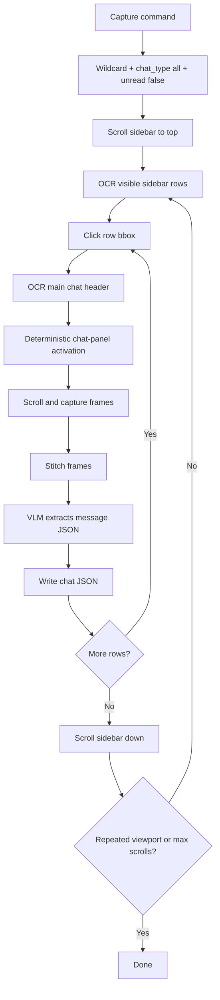

# Architecture

## Directory Structure

```
weclaw-cua/
├── weclaw_cli/                 # CLI layer (Click commands)
│   ├── main.py                 # Entry point
│   ├── context.py              # Config loading
│   └── commands/               # All CLI commands
│
├── algo_a/                     # Vision-based message capture
│   ├── pipeline_a_win.py       # Main capture pipeline
│   ├── capture_chat.py         # Screenshot scroll-capture engine
│   ├── extract_messages.py     # Vision LLM message extraction
│   └── ...                     # Sidebar scan, stitch, dedup
│
├── algo_b/                     # LLM report generation
│   ├── pipeline_b.py           # Report pipeline
│   ├── build_report_prompt.py  # Prompt construction
│   └── generate_report.py      # LLM call
│
├── platform_mac/               # macOS platform layer
│   ├── driver.py               # Quartz screenshots + CGEvent
│   └── ...                     # Window detection, stitching
│
├── platform_win/               # Windows platform layer
│   ├── driver.py               # Vision AI driver
│   └── ...                     # Window detection, UI Automation
│
├── shared/                     # Cross-cutting utilities
│   ├── platform_api.py         # PlatformDriver protocol
│   ├── vision_backend.py       # VisionBackend protocol
│   ├── stepwise_backend.py     # StepwiseBackend (images+prompts for agent)
│   ├── vision_ai.py            # Built-in OpenAI-compatible vision LLM
│   ├── message_schema.py       # Message dataclass
│   ├── llm_routing.py          # Multi-provider LLM routing
│   └── llm_client.py           # OpenAI-compatible text wrapper
│
├── config/                     # Configuration
├── tests/                      # Test suite
├── scripts/                    # Debug and utility scripts
├── sample_data/                # Sample JSON for local testing
├── npm/                        # npm binary distribution
├── pyproject.toml              # Python package config
└── entry.py                    # PyInstaller entry point
```

---

## Data Flow

```
weclaw-cua run / weclaw-cua capture
  │
  ├─ algo_a (vision capture)
  │   ├─ find WeChat window (OS API)
  │   ├─ select sidebar workflow
  │   │   ├─ capture-all fast path: OCR rows + top-to-bottom sweep
  │   │   └─ filtered path: sidebar semantics via vision AI when needed
  │   ├─ for each chat:
  │   │   ├─ click into chat
  │   │   ├─ resolve chat title from header OCR
  │   │   ├─ scroll + capture screenshots
  │   │   ├─ stitch into long image
  │   │   ├─ vision LLM → structured JSON
  │   │   └─ post-process + dedup
  │   └─ write JSON files to output/
  │
  └─ algo_b (report generation)
      ├─ load message JSONs
      ├─ build report prompt
      ├─ call LLM
      └─ output report text
```

## Capture-All Fast Path

The fastest workflow is used when the user asks for every chat without unread
or chat-type filtering:

- `groups_to_monitor` is `["*"]` or `[]`
- `chat_type` is `all`
- `sidebar_unread_only` is `false`

In this mode the sidebar does not need semantic classification. WeClaw only
needs visible row text and click boxes, so it avoids navigation-time VLM calls
and keeps the vision LLM focused on message extraction.



Platform details:

- Windows: `platform_win.driver.WinDriver.get_fast_sidebar_rows()` uses
  RapidOCR for sidebar row text and bounding boxes.
- macOS: `platform_mac.mac_ai_driver.MacDriver.get_fast_sidebar_rows()` uses
  native macOS Vision OCR via `platform_mac.sidebar_detector`.
- Both platforms use header OCR to resolve the full chat title after clicking a
  row, which avoids relying on truncated sidebar names.

The normal sidebar classification path remains in place for named chats,
group-only/private-only scans, and unread-only scans, because those modes need
metadata such as chat type and unread badge state.
